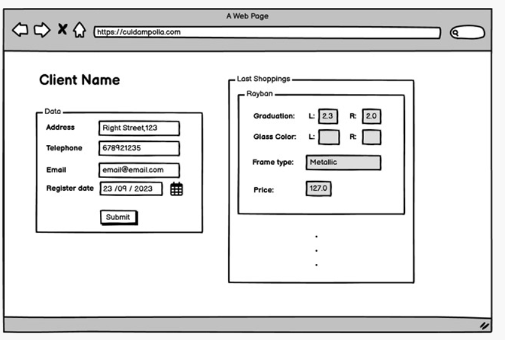
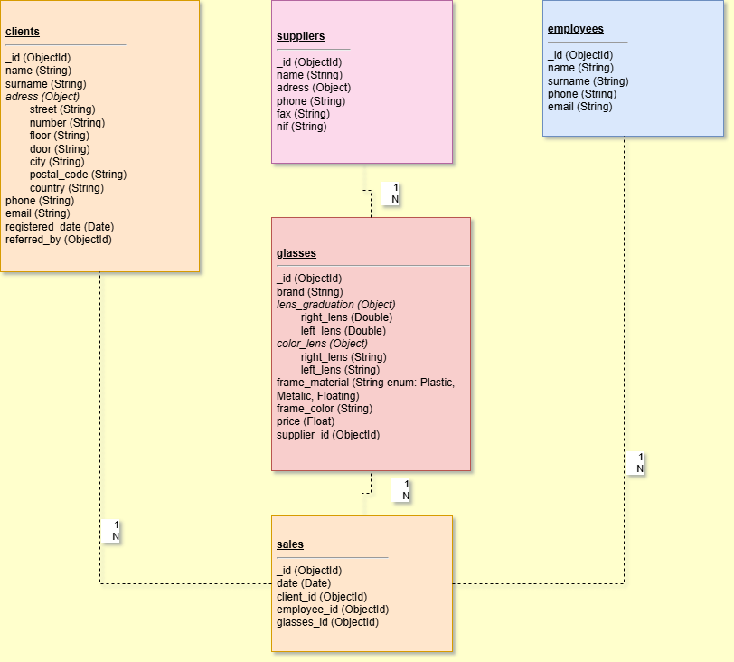

# Mongo DB structure
- Learn to model noSql databases with MongoDB
- Deliver diagram models of the databases using Moon Modeler or Draw.io.

### Level 1:

#### 📄 Task 1:

Design a MongoDB database that will store the required data for the following page:


Draw.io file: `mongoDB_diagram_drawio.txt`

Diagram:


### Collections

#### Clients
- `name`: *String* — Client's name.
- `surname`: *String* — Client's surname.
- `address`: *Object* — Includes street, number, floor, door, city, postal code, and country.
- `phone`: *String* — Client's phone number.
- `email`: *String* — Client's email address.
- `registered_date`: *ISODate* — Date and time the client registered.
- `refered_by`: *ObjectId (nullable)* — The ID of the client who referred them, if any.

#### Glasses
- `brand`: *String* — Brand name of the glasses.
- `lens_graduation`: *Number* — Includes Prescription for the left and right lens.
- `color_lens`: *String* — Includes Color of the left and right lens.
- `frame_type`: *String* — Type of frame (Enum: floating, plastic or metallic).
- `color_frame`: *String* — Color of the frame.
- `price`: *Number* — Price of the glasses.
- `supplier_id`: *ObjectId* — ID of the supplier.

#### Suppliers
- `name`: *String*
- `address`: *Object* — Includes street, number, floor, door, city, postal code, and country.
- `phone`: *String*
- `fax`: *String*
- `nif`: *String* — Legal ID number.

#### Sales
- `date`: *ISODate* — Date and time of the sale.
- `client_id`: *ObjectId* — ID of the client who made the purchase.
- `employee_id`: *ObjectId* — ID of the employee who processed the sale.
- `glasses_id`: *ObjectId* — ID of the glasses sold.

#### Employees
- `name`: *String*
- `surname`: *String*
- `phone`: *String*
- `email`: *String*

#### 📄 Task 2:
### Focus: Glasses-centric design

Each glasses document acts as an entry point to:
- The supplier that provides them.
- All sales related to that product.
- Clients who purchased them.
- A magnifier icon near the supplier name opens a popup with detailed supplier information.
- A list of clients shows who bought those glasses.
- Clicking on a client opens their personal record.

### Project Structure:
```mongodb-structure/
├── README.md
├── data/
│   ├── clients.json
│   ├── employee.json
│   ├── glasses.json
│   ├── sales.json
│   └── supplier.json
└── scripts/              // Optional: added script example to populate the DB
    └── db_initialization_script.js
    └── import_data.sh 
```

### 💻 Technologies Used:

- **MongoDB** – NoSQL database
- **MongoDB Compass** – Visual database manager
- **Docker** – For local MongoDB container setup
- **VS Code / Text Editor** – For JSON structure editing
- **Git & GitHub** – Version control and hosting

## 📋 Requirements:

To run and interact with this project locally, ensure you have:

- [ ] **Docker** installed (v20+ recommended)
- [ ] **MongoDB Compass** (latest version)
- [ ] **Git** (to clone the repo)
- [ ] A text editor (e.g., VS Code, Sublime, Notepad++)

## 🛠️ Installation:

To set up the MongoDB environment:

1. **Clone the repository**  
   ```bash
   git clone https://github.com/JavierDolo/S2.03.Level1_Mongo_Dates_Estrucuture.git
   
   ```

2. **Start MongoDB via Docker**  
   ```bash
   docker run -d -p 27017:27017 --name mongodb mongo
   ```

3. **Open MongoDB Compass**  
   Connect to:
   ```
   mongodb://localhost:27017
   ```

4. **Import the `.json` files** into your collections (`clients`, `glasses`, `suppliers`, `employees`, `sales`).

## ▶️ Execution

Once imported into MongoDB Compass:

- Browse the `glasses` collection to view glasses data.
- Check embedded supplier information and list of buying clients.
- Use `Aggregations` or `Find` queries to explore relationships.

## 🌐 Deployment

This is a local project for learning purposes. However, to deploy it:

1. Use **MongoDB Atlas** to host your cluster online.
2. Import the data via Compass or `mongoimport`.
3. Share the connection string with collaborators or connect your backend app.
